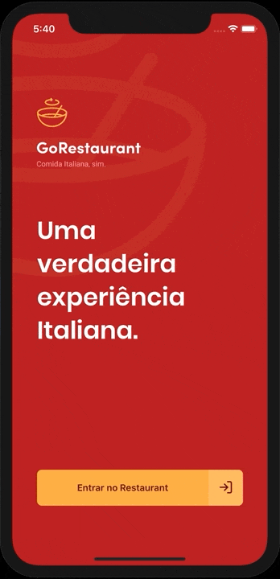

# 👨‍🍳 About
Sample food delivery application

# 🚀 Features
- 🔎 Browse available dishes
- 💖 Save favorite plates
- 🥡 Select dishes, extras and make order

<p align="center">
  
</p>

# 💻 Test locally

## Using yarn

### iOS
```sh
# Start the json server fake api and run development server
yarn
yarn json-server server.json -p 3333 & npx pod-install ios & yarn ios
```
### Android

```sh
# Start the json server fake api and run development server
yarn
yarn json-server server.json -p 3333 & yarn android
```

OR

## Using npm

### iOS
```sh
# Start the json server fake api and run development server
npm install
npx json-server server.json -p 3333 & npx pod-install ios & npm ios
```

### Android
```sh
# Start the json server fake api and run development server
npm install
npx json-server server.json -p 3333 & npm android
```


